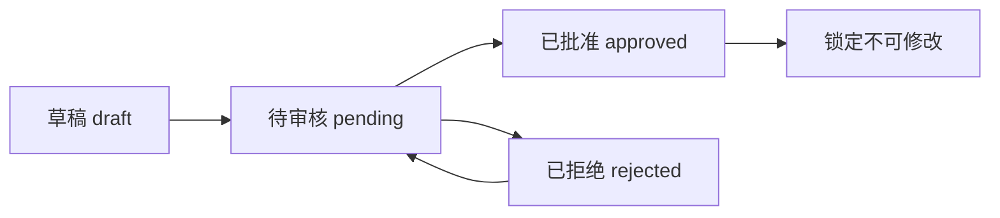
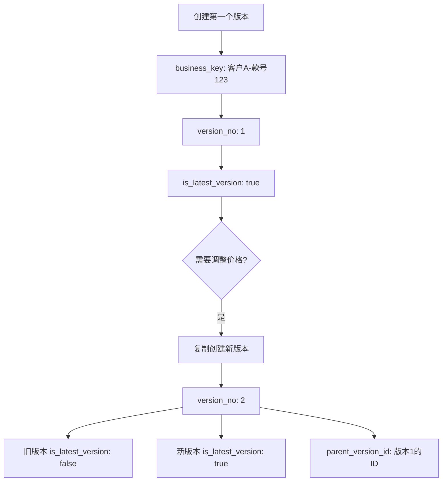

# 成本核算系统 - 数据库表设计 v2.0

## 📋 表结构总览

本系统采用**主表+明细表**的设计方案（主表包含汇总信息）：

```
1. rg_cost_calculations      (成本核算主表 - 包含基本信息、版本管理、成本汇总)
2. rg_cost_calculation_items (成本明细统一表)
```

**设计说明**：
- ✅ 将汇总信息合并到主表，避免1对1的JOIN查询
- ✅ 支持版本管理，同一款号可有多个核算版本
- ✅ 关联合同编号，支持合同维度查询
- ✅ 明细表通过 `item_type` 区分四种成本类型

---

## 1️⃣ 主表：`rg_cost_calculations`

### 表说明
- **表名**: `rg_cost_calculations`
- **说明**: 成本核算主表，存储基本信息、版本管理、审批流程和成本汇总
- **关系**: 
  - 1对多 → `rg_cost_calculation_items`

### 字段定义

#### 基本信息区

| 字段名 | 类型 | 必填 | 说明 | 索引 |
|--------|------|------|------|------|
| **id** | VARCHAR(36) / UUID | ✅ | 主键 | PK |
| **season** | VARCHAR(50) | ❌ | 季节 | - |
| **customer** | VARCHAR(100) | ❌ | 客户 | INDEX |
| **contract_no** | VARCHAR(50) | ❌ | 合同编号 | INDEX |
| **contract_date** | DATE | ❌ | 合同日期 | - |
| **order_mode** | VARCHAR(50) | ❌ | 订单模式（默认：生产加工型） | - |
| **production_type** | VARCHAR(50) | ❌ | 生产类型 | - |
| **style** | VARCHAR(100) | ❌ | 款式 | INDEX |
| **style_number** | VARCHAR(50) | ❌ | 款号 | INDEX |
| **confirm_date** | DATE | ❌ | 确认报价日期 | - |
| **final_customer_price** | VARCHAR(50) | ❌ | 最终客户确认价 | - |
| **size_range** | VARCHAR(100) | ❌ | 尺码范围 | - |
| **color_info** | VARCHAR(100) | ❌ | 颜色信息 | - |
| **has_customer_paper** | VARCHAR(20) | ❌ | 有无客供纸样 | - |
| **paper_value** | VARCHAR(50) | ❌ | 纸样价值 | - |
| **first_order_quantity** | INTEGER | ❌ | 首单数量 | - |
| **paper_sample_maker** | VARCHAR(50) | ❌ | 纸样师 | - |
| **style_image_url** | VARCHAR(500) | ❌ | 款式图片URL | - |
| **currency** | VARCHAR(10) | ❌ | 币种（如：CNY/USD） | - |

#### 版本管理区

| 字段名 | 类型 | 必填 | 说明 | 索引 |
|--------|------|------|------|------|
| **business_key** | VARCHAR(100) | ✅ | 业务主键（客户+款号） | INDEX |
| **version_no** | INTEGER | ✅ | 版本号（1, 2, 3...） | - |
| **is_latest_version** | BOOLEAN | ✅ | 是否最新版本（默认 true） | INDEX |
| **parent_version_id** | VARCHAR(36) | ❌ | 父版本ID（从哪个版本复制） | INDEX |
| **version_remark** | VARCHAR(200) | ❌ | 版本说明（如：调整面料价格） | - |

#### 成本汇总区

| 字段名 | 类型 | 必填 | 说明 | 索引 |
|--------|------|------|------|------|
| **fabric_cost** | DECIMAL(10,2) | ✅ | 面料总成本 | - |
| **accessory_cost** | DECIMAL(10,2) | ✅ | 辅料总成本 | - |
| **process_cost** | DECIMAL(10,2) | ✅ | 特殊工艺总成本 | - |
| **production_cost** | DECIMAL(10,2) | ✅ | 生产其他成本 | - |
| **total_production_cost** | DECIMAL(10,2) | ✅ | 生产总成本 | - |
| **profit_percentage** | DECIMAL(5,2) | ✅ | 利润百分比(%)，默认15 | - |
| **profit_amount** | DECIMAL(10,2) | ✅ | 利润金额 | - |
| **fob_price** | DECIMAL(10,2) | ✅ | FOB总价 | - |
| **fob_usd_price** | VARCHAR(50) | ❌ | FOB美金价格 | - |

#### 审批流程区

| 字段名 | 类型 | 必填 | 说明 | 索引 |
|--------|------|------|------|------|
| **status** | VARCHAR(20) | ✅ | 状态: draft/pending/approved/rejected | INDEX |
| **creator** | VARCHAR(50) | ❌ | 制表人 | INDEX |
| **reviewer** | VARCHAR(50) | ❌ | 审核人 | - |
| **approver** | VARCHAR(50) | ❌ | 审批人 | - |

#### 时间戳区

| 字段名 | 类型 | 必填 | 说明 | 索引 |
|--------|------|------|------|------|
| **created_at** | TIMESTAMP | ✅ | 创建时间 | INDEX |
| **updated_at** | TIMESTAMP | ✅ | 更新时间 | - |

### 索引设计
```sql
PRIMARY KEY (id)
INDEX idx_customer (customer)
INDEX idx_contract_no (contract_no)
INDEX idx_style (style)
INDEX idx_style_number (style_number)
INDEX idx_business_key (business_key)
INDEX idx_latest_version (business_key, is_latest_version)
INDEX idx_parent_version (parent_version_id)
INDEX idx_status (status)
INDEX idx_creator (creator)
INDEX idx_created_at (created_at)
UNIQUE INDEX idx_business_version (business_key, version_no)
```

### 重要约束
```sql
-- 确保同一业务主键下版本号唯一
UNIQUE (business_key, version_no)

-- 业务主键生成规则
business_key = customer + '-' + style_number
-- 例如: "ZARA-SS2025-001"
```

---

## 2️⃣ 明细表：`rg_cost_calculation_items`

### 表说明
- **表名**: `rg_cost_calculation_items`
- **说明**: 成本明细统一表，通过`item_type`区分四种类型
  - `fabric`: 面料
  - `accessory`: 辅料
  - `process`: 特殊工艺
  - `production`: 生产其他成本
- **关系**: 多对1 → `rg_cost_calculations`

### 字段定义

| 字段名 | 类型 | 必填 | 说明 | 适用类型 |
|--------|------|------|------|----------|
| **id** | VARCHAR(36) / UUID | ✅ | 主键 | ALL |
| **calculation_id** | VARCHAR(36) | ✅ | 外键 → rg_cost_calculations.id | ALL |
| **item_type** | VARCHAR(20) | ✅ | 明细类型: fabric/accessory/process/production | ALL |
| **sequence** | INTEGER | ✅ | 序号（用于排序） | ALL |
| | | | | |
| **material_code** | VARCHAR(50) | ❌ | 物料编码 | fabric, accessory, process |
| **supplier** | VARCHAR(100) | ❌ | 供应商（生产成本时存费用名称） | ALL |
| **name** | VARCHAR(100) | ❌ | 物料名称 | fabric, accessory, process |
| **color** | VARCHAR(50) | ❌ | 颜色 | fabric, accessory |
| **property** | VARCHAR(100) | ❌ | 特性/属性 | fabric, accessory, process |
| | | | | |
| **unit_price** | DECIMAL(10,2) | ❌ | 含税单价 | ALL |
| **net_consumption** | DECIMAL(10,4) | ❌ | 净耗 | fabric, accessory, process |
| **loss_rate** | DECIMAL(5,2) | ❌ | 损耗率(%) | ALL |
| **total_consumption** | DECIMAL(10,4) | ❌ | 总耗（计算字段） | fabric, accessory, process |
| **amount** | DECIMAL(10,2) | ❌ | 金额（计算字段） | ALL |
| | | | | |
| **weight** | VARCHAR(50) | ❌ | 克重(g) | fabric |
| **width** | VARCHAR(50) | ❌ | 门幅 | fabric |
| **unit** | VARCHAR(20) | ❌ | 单位 | accessory |
| **position** | VARCHAR(100) | ❌ | 工艺位置 | process |
| | | | | |
| **description** | VARCHAR(200) | ❌ | 费用说明 | production |
| **difficulty_point** | VARCHAR(200) | ❌ | 此款工艺难点 | production |
| **quantity** | DECIMAL(10,2) | ❌ | 单件数量 | production |
| **work_hours** | DECIMAL(10,2) | ❌ | 工时 | production |
| | | | | |
| **created_at** | TIMESTAMP | ✅ | 创建时间 | ALL |
| **updated_at** | TIMESTAMP | ✅ | 更新时间 | ALL |

### 索引设计
```sql
PRIMARY KEY (id)
INDEX idx_calculation_id (calculation_id)
INDEX idx_calculation_type (calculation_id, item_type)
INDEX idx_sequence (calculation_id, sequence)
FOREIGN KEY (calculation_id) REFERENCES rg_cost_calculations(id) ON DELETE CASCADE
```

### 字段使用矩阵

| 字段 | fabric | accessory | process | production |
|------|--------|-----------|---------|------------|
| material_code | ✅ | ✅ | ✅ | ❌ |
| supplier | ✅ | ✅ | ✅ | ✅ (费用名称) |
| name | ✅ | ✅ | ✅ | ❌ |
| color | ✅ | ✅ | ❌ | ❌ |
| property | ✅ | ✅ | ✅ | ❌ |
| unit_price | ✅ | ✅ | ✅ | ✅ |
| net_consumption | ✅ | ✅ | ✅ | ❌ |
| loss_rate | ✅ | ✅ | ✅ | ✅ |
| total_consumption | ✅ | ✅ | ✅ | ❌ |
| amount | ✅ | ✅ | ✅ | ✅ |
| weight | ✅ | ❌ | ❌ | ❌ |
| width | ✅ | ❌ | ❌ | ❌ |
| unit | ❌ | ✅ | ❌ | ❌ |
| position | ❌ | ❌ | ✅ | ❌ |
| description | ❌ | ❌ | ❌ | ✅ |
| difficulty_point | ❌ | ❌ | ❌ | ✅ |
| quantity | ❌ | ❌ | ❌ | ✅ |
| work_hours | ❌ | ❌ | ❌ | ✅ |

---

## 📐 计算逻辑

### 明细表计算公式

```javascript
// 通用计算（面料、辅料、工艺）
total_consumption = net_consumption × (1 + loss_rate / 100)
amount = unit_price × total_consumption

// 生产成本计算
amount = unit_price × quantity
```

### 主表汇总计算公式

```javascript
// 分类成本汇总（从明细表聚合）
fabric_cost = SUM(amount WHERE item_type='fabric')
accessory_cost = SUM(amount WHERE item_type='accessory')
process_cost = SUM(amount WHERE item_type='process')
production_cost = SUM(amount WHERE item_type='production')

// 总成本和报价
total_production_cost = fabric_cost + accessory_cost + process_cost + production_cost
profit_amount = total_production_cost × (profit_percentage / 100)
fob_price = total_production_cost + profit_amount
```

---

## 🔄 业务流程与数据流转

### 状态流转



### 版本管理流程



### 数据操作流程

1. **创建首个版本**
   ```sql
   -- 生成 business_key
   business_key = customer + '-' + style_number
   
   -- 初始版本
   version_no = 1
   is_latest_version = true
   parent_version_id = NULL
   status = 'draft'
   
   -- 初始化汇总字段为0
   fabric_cost = 0
   accessory_cost = 0
   ...
   ```

2. **录入明细数据**
   - 插入/更新 `rg_cost_calculation_items` 记录
   - 实时计算 `total_consumption` 和 `amount`

3. **计算汇总**
   - 根据明细表统计各类成本
   - 更新主表的汇总字段

4. **创建新版本**
   ```sql
   -- 查询当前最大版本号
   SELECT MAX(version_no) FROM rg_cost_calculations 
   WHERE business_key = '客户A-款号123'
   
   -- 复制旧版本数据
   INSERT INTO rg_cost_calculations (...)
   SELECT ... FROM rg_cost_calculations WHERE id = '旧版本ID'
   
   -- 设置新版本信息
   version_no = 旧版本 + 1
   is_latest_version = true
   parent_version_id = '旧版本ID'
   version_remark = '调整面料价格'
   
   -- 将旧版本标记为非最新
   UPDATE rg_cost_calculations 
   SET is_latest_version = false 
   WHERE id = '旧版本ID'
   ```

5. **提交审核**
   - 更新 `status='pending'`
   - 锁定明细数据，不可编辑

6. **审批操作**
   - 批准：`status='approved'`，数据永久锁定
   - 拒绝：`status='rejected'`，可修改后重新提交

---

## 🎯 设计优势

### ✅ 优点

1. **简化架构**
   - 只有2张表，结构清晰
   - 避免1对1的JOIN查询
   - 查询性能更好

2. **版本管理完善**
   - 支持同一款号多版本核算
   - 可追溯版本演变链路
   - 快速查询最新版本

3. **业务完整性**
   - 一张主表包含完整的成本核算信息
   - 符合业务人员理解
   - 前端对象映射更简单

4. **合同关联**
   - 支持从合同维度查询成本核算
   - 便于合同履约管理

5. **数据完整性**
   - 外键约束确保关联正确
   - 唯一索引确保版本号不重复
   - 级联删除保证数据一致性

### ⚠️ 注意事项

1. **汇总字段更新**
   - 明细数据变化时，需同步更新主表汇总字段
   - 建议在应用层或数据库触发器中实现

2. **版本创建**
   - 必须先查询最大版本号
   - 必须更新旧版本的 `is_latest_version` 标志
   - 建议使用事务确保原子性

3. **数据锁定**
   - 状态为 `approved` 后，应禁止修改
   - 建议增加数据库触发器或应用层校验

4. **business_key 生成**
   - 确保唯一性和可读性
   - 建议格式：`{customer}-{style_number}`

---

## 📝 SQL 创建脚本

```sql
-- 主表
CREATE TABLE rg_cost_calculations (
    id VARCHAR(36) PRIMARY KEY,
    
    -- 基本信息
    season VARCHAR(50),
    customer VARCHAR(100),
    contract_no VARCHAR(50),
    contract_date DATE,
    order_mode VARCHAR(50),
    production_type VARCHAR(50),
    style VARCHAR(100),
    style_number VARCHAR(50),
    confirm_date DATE,
    final_customer_price VARCHAR(50),
    size_range VARCHAR(100),
    color_info VARCHAR(100),
    has_customer_paper VARCHAR(20),
    paper_value VARCHAR(50),
    first_order_quantity INTEGER,
    paper_sample_maker VARCHAR(50),
    style_image_url VARCHAR(500),
    currency VARCHAR(10),
    
    -- 版本管理
    business_key VARCHAR(100) NOT NULL,
    version_no INTEGER NOT NULL,
    is_latest_version BOOLEAN NOT NULL DEFAULT true,
    parent_version_id VARCHAR(36),
    version_remark VARCHAR(200),
    
    -- 成本汇总
    fabric_cost DECIMAL(10,2) NOT NULL DEFAULT 0,
    accessory_cost DECIMAL(10,2) NOT NULL DEFAULT 0,
    process_cost DECIMAL(10,2) NOT NULL DEFAULT 0,
    production_cost DECIMAL(10,2) NOT NULL DEFAULT 0,
    total_production_cost DECIMAL(10,2) NOT NULL DEFAULT 0,
    profit_percentage DECIMAL(5,2) NOT NULL DEFAULT 15.00,
    profit_amount DECIMAL(10,2) NOT NULL DEFAULT 0,
    fob_price DECIMAL(10,2) NOT NULL DEFAULT 0,
    fob_usd_price VARCHAR(50),
    
    -- 审批流程
    status VARCHAR(20) NOT NULL DEFAULT 'draft',
    creator VARCHAR(50),
    reviewer VARCHAR(50),
    approver VARCHAR(50),
    
    -- 时间戳
    created_at TIMESTAMP NOT NULL DEFAULT CURRENT_TIMESTAMP,
    updated_at TIMESTAMP NOT NULL DEFAULT CURRENT_TIMESTAMP ON UPDATE CURRENT_TIMESTAMP,
    
    -- 索引
    INDEX idx_customer (customer),
    INDEX idx_contract_no (contract_no),
    INDEX idx_style (style),
    INDEX idx_style_number (style_number),
    INDEX idx_business_key (business_key),
    INDEX idx_latest_version (business_key, is_latest_version),
    INDEX idx_parent_version (parent_version_id),
    INDEX idx_status (status),
    INDEX idx_creator (creator),
    INDEX idx_created_at (created_at),
    
    -- 唯一约束
    UNIQUE INDEX idx_business_version (business_key, version_no)
) ENGINE=InnoDB DEFAULT CHARSET=utf8mb4 COMMENT='成本核算主表';

-- 明细表
CREATE TABLE rg_cost_calculation_items (
    id VARCHAR(36) PRIMARY KEY,
    calculation_id VARCHAR(36) NOT NULL,
    item_type VARCHAR(20) NOT NULL COMMENT 'fabric/accessory/process/production',
    sequence INTEGER NOT NULL,
    
    -- 通用字段
    material_code VARCHAR(50),
    supplier VARCHAR(100),
    name VARCHAR(100) COMMENT '物料名称',
    color VARCHAR(50),
    property VARCHAR(100),
    
    -- 价格和消耗
    unit_price DECIMAL(10,2),
    net_consumption DECIMAL(10,4),
    loss_rate DECIMAL(5,2),
    total_consumption DECIMAL(10,4),
    amount DECIMAL(10,2),
    
    -- 面料特有
    weight VARCHAR(50),
    width VARCHAR(50),
    
    -- 辅料特有
    unit VARCHAR(20),
    
    -- 工艺特有
    position VARCHAR(100),
    
    -- 生产成本特有
    description VARCHAR(200),
    difficulty_point VARCHAR(200),
    quantity DECIMAL(10,2),
    work_hours DECIMAL(10,2),
    
    -- 时间戳
    created_at TIMESTAMP NOT NULL DEFAULT CURRENT_TIMESTAMP,
    updated_at TIMESTAMP NOT NULL DEFAULT CURRENT_TIMESTAMP ON UPDATE CURRENT_TIMESTAMP,
    
    -- 索引
    INDEX idx_calculation_id (calculation_id),
    INDEX idx_calculation_type (calculation_id, item_type),
    INDEX idx_sequence (calculation_id, sequence),
    
    -- 外键
    FOREIGN KEY (calculation_id) REFERENCES rg_cost_calculations(id) ON DELETE CASCADE
) ENGINE=InnoDB DEFAULT CHARSET=utf8mb4 COMMENT='成本明细统一表';
```

---

## 🔍 常用查询示例

### 查询某款号的最新版本

```sql
SELECT * FROM rg_cost_calculations 
WHERE business_key = '客户A-款号123' 
AND is_latest_version = true;
```

### 查询某款号的所有历史版本

```sql
SELECT 
    version_no,
    version_remark,
    fob_price,
    profit_percentage,
    status,
    created_at
FROM rg_cost_calculations
WHERE business_key = '客户A-款号123'
ORDER BY version_no DESC;
```

### 查询完整的成本核算单（含明细）

```sql
SELECT 
    c.*,
    (SELECT JSON_ARRAYAGG(JSON_OBJECT(
        'id', id,
        'material_code', material_code,
        'supplier', supplier,
        'name', name,
        'amount', amount
    )) FROM rg_cost_calculation_items WHERE calculation_id = c.id AND item_type = 'fabric') as fabric_items,
    (SELECT JSON_ARRAYAGG(JSON_OBJECT(
        'id', id,
        'material_code', material_code,
        'supplier', supplier,
        'name', name,
        'amount', amount
    )) FROM rg_cost_calculation_items WHERE calculation_id = c.id AND item_type = 'accessory') as accessory_items,
    (SELECT JSON_ARRAYAGG(JSON_OBJECT(
        'id', id,
        'material_code', material_code,
        'supplier', supplier,
        'name', name,
        'amount', amount
    )) FROM rg_cost_calculation_items WHERE calculation_id = c.id AND item_type = 'process') as process_items,
    (SELECT JSON_ARRAYAGG(JSON_OBJECT(
        'id', id,
        'supplier', supplier,
        'description', description,
        'amount', amount
    )) FROM rg_cost_calculation_items WHERE calculation_id = c.id AND item_type = 'production') as production_items
FROM rg_cost_calculations c
WHERE c.id = 'xxx';
```

### 查询某合同的所有成本核算

```sql
SELECT 
    id,
    customer,
    style_number,
    version_no,
    is_latest_version,
    fob_price,
    status,
    created_at
FROM rg_cost_calculations
WHERE contract_no = 'CONTRACT-2025-001'
ORDER BY business_key, version_no;
```

### 统计某客户的成本核算汇总

```sql
SELECT 
    customer,
    COUNT(DISTINCT business_key) as style_count,
    COUNT(*) as total_versions,
    AVG(fob_price) as avg_fob_price,
    SUM(CASE WHEN is_latest_version = true THEN fob_price ELSE 0 END) as total_latest_fob_price
FROM rg_cost_calculations
WHERE customer = 'xxx' AND status = 'approved'
GROUP BY customer;
```

### 版本对比查询

```sql
SELECT 
    v1.version_no as version_1,
    v2.version_no as version_2,
    v1.fob_price as fob_price_v1,
    v2.fob_price as fob_price_v2,
    (v2.fob_price - v1.fob_price) as price_diff,
    v1.fabric_cost as fabric_cost_v1,
    v2.fabric_cost as fabric_cost_v2,
    v2.version_remark as change_reason
FROM rg_cost_calculations v1
JOIN rg_cost_calculations v2 ON v1.id = v2.parent_version_id
WHERE v1.business_key = '客户A-款号123';
```

---

## 💡 最佳实践

### 1. 创建新版本的标准流程

```javascript
async function createNewVersion(oldVersionId, versionRemark) {
  const transaction = await db.beginTransaction();
  
  try {
    // 1. 查询旧版本
    const oldVersion = await db.query(
      'SELECT * FROM rg_cost_calculations WHERE id = ?', 
      [oldVersionId]
    );
    
    // 2. 查询当前最大版本号
    const maxVersion = await db.query(
      'SELECT MAX(version_no) as max FROM rg_cost_calculations WHERE business_key = ?',
      [oldVersion.business_key]
    );
    
    // 3. 插入新版本
    const newVersion = {
      ...oldVersion,
      id: generateUUID(),
      version_no: maxVersion.max + 1,
      is_latest_version: true,
      parent_version_id: oldVersionId,
      version_remark: versionRemark,
      status: 'draft',
      created_at: new Date(),
      updated_at: new Date()
    };
    
    await db.insert('rg_cost_calculations', newVersion);
    
    // 4. 更新旧版本标记
    await db.update(
      'rg_cost_calculations',
      { is_latest_version: false },
      { id: oldVersionId }
    );
    
    // 5. 复制明细数据（可选）
    await db.query(`
      INSERT INTO rg_cost_calculation_items 
        (id, calculation_id, item_type, sequence, ...)
      SELECT 
        UUID(), ?, item_type, sequence, ...
      FROM rg_cost_calculation_items
      WHERE calculation_id = ?
    `, [newVersion.id, oldVersionId]);
    
    await transaction.commit();
    return newVersion;
    
  } catch (error) {
    await transaction.rollback();
    throw error;
  }
}
```

### 2. 更新汇总字段的触发器（可选）

```sql
DELIMITER $$

CREATE TRIGGER update_cost_summary
AFTER INSERT ON rg_cost_calculation_items
FOR EACH ROW
BEGIN
    UPDATE rg_cost_calculations
    SET 
        fabric_cost = (
            SELECT COALESCE(SUM(amount), 0) 
            FROM rg_cost_calculation_items 
            WHERE calculation_id = NEW.calculation_id AND item_type = 'fabric'
        ),
        accessory_cost = (
            SELECT COALESCE(SUM(amount), 0) 
            FROM rg_cost_calculation_items 
            WHERE calculation_id = NEW.calculation_id AND item_type = 'accessory'
        ),
        process_cost = (
            SELECT COALESCE(SUM(amount), 0) 
            FROM rg_cost_calculation_items 
            WHERE calculation_id = NEW.calculation_id AND item_type = 'process'
        ),
        production_cost = (
            SELECT COALESCE(SUM(amount), 0) 
            FROM rg_cost_calculation_items 
            WHERE calculation_id = NEW.calculation_id AND item_type = 'production'
        )
    WHERE id = NEW.calculation_id;
    
    UPDATE rg_cost_calculations
    SET 
        total_production_cost = fabric_cost + accessory_cost + process_cost + production_cost,
        profit_amount = (fabric_cost + accessory_cost + process_cost + production_cost) * profit_percentage / 100,
        fob_price = (fabric_cost + accessory_cost + process_cost + production_cost) * (1 + profit_percentage / 100)
    WHERE id = NEW.calculation_id;
END$$

DELIMITER ;
```

---

**文档版本**: v2.0  
**创建日期**: 2025-10-14  
**最后更新**: 2025-10-14  
**主要变更**:
- 合并汇总表到主表
- 新增版本管理字段
- 新增合同编号字段
- 简化为两张表设计
